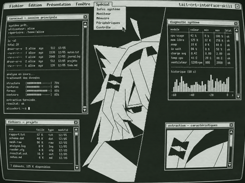

# Multica 内网部署工具

这是一个独立的 Multica 自托管部署工具。它把首次安装、NAS 路径探测、源码构建、升级、诊断和回滚收进一条可重复的工作流，让换机器或交给别人维护时不需要重新翻聊天记录，也不需要手工拼 Docker 命令。

这个部署入口只负责 Multica 本身，不依赖 Agent 治理仓、Skill 仓或具体 Agent 工具。其它系统通过可选适配器接入，不进入 NAS 部署生命周期。



## 先记住四件事

- 部署入口是私网 HTTP：地址由你传入的 `--nas-ip` 和 `--app-port` 生成。Caddy 只绑定这个地址；没有配置 HTTPS，也不要把 3010、3011、3012 端口映射到公网。
- 部署目标上的 `.env` 含 JWT、数据库和 VCS 密钥，只在目标主机保存，脚本升级时不会覆盖；不要把它复制到聊天、工单或 Git。
- Multica 当前生产登录仍是邮箱验证码；现在也支持把内网 Gitea 作为 OAuth2/OIDC 登录源。想要纯内网体验，优先配置 Gitea 登录，SMTP 作为回退。
- 只有开发/验收时才使用“内网测试固定验证码”。它会把 `APP_ENV` 切到非生产并关闭发信服务，不能作为公网或正式生产登录方案。

## NetBird 跨设备访问（推荐）

使用 `--netbird` 后，`--nas-ip` 必须填写 NAS 的 NetBird IPv4 地址。工具会在写入配置前核验 NAS 上 NetBird 的管理、信令连接和实际 IP；并把这个地址写入 Caddy、CORS、`MULTICA_APP_URL` 和 Gitea OAuth 默认回调。Caddy 只监听该 NetBird 地址，不接受 LAN 或公网接口的 3010 连接。

```powershell
python .\multica_deploy.py deploy `
  --nas-host nas --nas-ip 100.80.110.105 --netbird `
  --docker-path /var/packages/ContainerManager/target/usr/bin/docker `
  --nas-target /volume1/docker/multica --owner YOUR_SSH_USER --group users
```

其他桌面端和 5090 等异地设备必须加入同一个 NetBird 网络，并被策略允许访问 NAS 的 TCP 3010；客户端统一使用 `http://100.80.110.105:3010`。如设备使用本地 HTTP 代理，请将 NetBird 地址段加入 `NO_PROXY`。Gitea OAuth 应用的回调地址必须精确填写为 `http://100.80.110.105:3010/auth/callback`。

## 文件职责

| 文件 | 用途 |
| --- | --- |
| `install.py` | 新用户首次安装入口；检查 SSH 后启动向导 |
| `multica_deploy.py` | 推荐入口；Python 标准库实现部署、状态、日志和验证码命令 |
| `multica-deploy.sh` | Linux/macOS 命令行启动 Python 入口 |
| `multica-admin.sh` | Linux/macOS 交互式管理菜单 |
| `multica-tool.sh` | Linux/macOS 部署工具统一入口 |
| `package.py` | 维护者用标准库生成干净 ZIP 和 SHA256 校验文件 |
| `compat/windows/` | 可选 Windows `.cmd` / PowerShell 兼容层；不是核心安装依赖 |
| `docker-compose.selfhost.yml` | Multica 官方 PostgreSQL、backend、frontend 定义 |
| `docker-compose.nas.yml` | NAS 专用 Caddy 和固定 Docker 子网 |
| `Caddyfile` | 同源入口、backend 健康检查和 WebSocket 转发 |
| `.env.template` | 非敏感默认配置；真实 `.env` 在部署目标首次部署时生成 |

## 推荐入口：部署工具

这不是把当前 NAS 配置打包进去的快照，而是一个可重复使用的部署工具。它只需要 Python 3.9+、对应平台的 OpenSSH（Windows OpenSSH、Linux `openssh-client` 或 macOS OpenSSH），不需要安装 pip 包。

### 平台支持矩阵

| 角色 | 支持范围 |
| --- | --- |
| 管理机 | Windows、Linux、macOS |
| 本地构建机 | Windows/macOS 的 Docker Desktop，或 Linux Docker |
| 远端部署目标 | Synology Container Manager，或可通过 SSH 管理的 Linux Docker 主机 |

命令里的 `--nas-*` 是历史兼容命名，目标不一定是 NAS。当前版本还没有把 Windows Docker 主机作为远端部署目标：远程流程依赖 POSIX shell、`sudo`、`sed`、`curl` 和 Linux 风格的 Compose 路径；但 Windows Docker Desktop 作为本机构建机是支持的。

### 给新用户的最短路径

下载或克隆本仓库后，在仓库根目录运行一次 `install.py`：

```bash
git clone https://github.com/2233admin/multica-deployment-tool.git
cd multica-deployment-tool
```

Windows：

```powershell
cd multica-deployment-tool
python .\install.py
```

Linux/macOS：

```bash
cd multica-deployment-tool
python3 install.py
```

安装器会检查 `ssh/scp`，然后进入引导安装：填写 SSH 主机和端口后，它会尽力自动探测远端用户、用户组和 Docker 路径；接着选择 Synology 或普通 Linux，确认目标地址后直接部署。部署完成后会询问登录验证方式：Gitea（内网推荐）、内网 SMTP、内网测试固定验证码、Resend 或稍后配置。常见 Synology 场景只需几次输入；需要改目录、Docker 或用户组时再展开高级参数。不会修改源码，也不要求手工编辑 `.env`。

推荐在任何平台运行 `python multica_deploy.py wizard`；Linux/macOS 也可以运行 `bash multica-tool.sh`。Windows 的 `.cmd` / PowerShell 兼容入口放在 `compat/windows/`，不是核心安装依赖。菜单里可以部署、查看状态、配置登录验证、配置 GitHub 或查看日志；密码不会写进命令行。

第一次在菜单里选择“修改 NAS 连接参数”，填完后会把非敏感连接参数保存到当前用户的配置目录。配置文件不在源码目录，也不会进入开源压缩包；数据库、JWT、SMTP、GitHub 私钥等秘密仍只在部署目标上保存。

```powershell
python .\multica_deploy.py wizard
```

Linux/macOS：

```bash
bash multica-tool.sh
```

配置保存位置：Windows 是 `%APPDATA%\Multica\deploy.json`；Linux/macOS 默认是 `~/.config/multica/deploy.json`。里面只有 SSH 主机、NAS IP、目录、Docker 路径和用户组等部署参数，没有应用密钥或邮箱密码。需要切换环境时可在菜单里重新填写，或通过 `--config-file` 指定另一份配置。

### 维护者打包

发布前在本目录运行：

```powershell
python .\package.py
```

脚本只收集部署入口、Compose 模板、可选适配器和测试文件，不会把 `.env`、`__pycache__`、本地日志或管理机配置带进压缩包；同时生成同名 `.sha256` 校验文件。

不带子命令时默认执行部署/升级；开源工具不会内置任何 NAS 地址，首次使用必须传入 `--nas-host`、`--nas-ip`，或先在菜单里填写。常用命令：

```powershell
# 指定版本升级
python .\multica_deploy.py deploy --nas-host YOUR_SSH_HOST --nas-ip YOUR_NAS_IP --image-tag v0.4.27

# 查看状态
python .\multica_deploy.py status --nas-host YOUR_SSH_HOST --nas-ip YOUR_NAS_IP

# 查看脱敏日志
python .\multica_deploy.py logs --nas-host YOUR_SSH_HOST --nas-ip YOUR_NAS_IP --service backend --since 15m

# 查看注册验证码（只在自己的终端查看）
python .\multica_deploy.py code --nas-host YOUR_SSH_HOST --nas-ip YOUR_NAS_IP --since 10m
```

部署前可以先做只读诊断：

```powershell
python .\multica_deploy.py doctor --nas-host YOUR_SSH_HOST --nas-ip YOUR_NAS_IP
```

稳定版本升级和回滚使用明确的命令：

```powershell
python .\multica_deploy.py upgrade `
  --nas-host YOUR_SSH_HOST --nas-ip YOUR_NAS_IP --image-tag v0.4.27

python .\multica_deploy.py rollback `
  --nas-host YOUR_SSH_HOST --nas-ip YOUR_NAS_IP
```

每次成功部署前，工具只记录上一个 backend/web 镜像引用到部署目标的受限状态文件，不保存 JWT、数据库密码或 Gitea Secret。回滚不会猜测数据库迁移是否可逆；如果新版本已经执行了不可逆迁移，应先恢复数据库快照，再回滚镜像。

### 修改 Multica 后一条命令重新部署

如果你修改了自己的 Multica fork，不需要手工执行 `docker build`、`docker save`、`scp`、`docker load` 和 Compose 重启。部署工具可以直接从当前源码构建 backend/web 镜像，传到远端 Docker，再重启并检查健康状态：

```powershell
python .\multica_deploy.py build `
  --source-dir ..\multica `
  --nas-host YOUR_SSH_HOST --nas-ip YOUR_NAS_IP `
  --image-tag dev-20260816
```

首次执行会保存 `--source-dir`；之后可以省略它。这个流程使用远端临时镜像归档，不要求搭建 Docker Registry。工具会读取本机和远端 Docker 的架构；架构相同时使用 Compose 构建，架构不同时自动切换 Docker buildx：

```powershell
python .\multica_deploy.py build `
  --source-dir ..\multica `
  --nas-host YOUR_SSH_HOST --nas-ip YOUR_NAS_IP `
  --platform linux/arm64 `
  --image-tag dev-arm64
```

跨架构构建需要管理机的 Docker Desktop/Linux Docker 支持 buildx；如果目标架构没有对应 builder，工具会在构建前明确报错。

修改源码后的日常流程变成：

```text
编辑 work/multica → 运行 build → 自动构建 → 上传 NAS → 重启 → /readyz 验证
```

没有 SSH config 别名时，直接传你的主机和端口（把占位符替换成真实值）：

```powershell
python .\multica_deploy.py deploy --nas-host YOUR_SSH_HOST --ssh-port 22 --nas-ip YOUR_NAS_IP
```

Windows 也可以用同目录的快捷入口：

```powershell
python .\multica_deploy.py status --nas-host YOUR_SSH_HOST --nas-ip YOUR_NAS_IP
```

如果是我们自己构建的 Gitea 补丁镜像，除了版本标签，还要指定两个镜像仓库；backend 和 web 必须使用同一套版本：

```powershell
python .\multica_deploy.py deploy `
  --nas-host YOUR_SSH_HOST --nas-ip YOUR_NAS_IP `
  --backend-image registry.example.com/team/multica-backend `
  --web-image registry.example.com/team/multica-web `
  --image-tag v0.4.28
```

镜像仓库地址只保存在本地非敏感部署配置和部署目标的 `.env` 中；不要把 registry 密码写进命令行。私有仓库登录应提前在目标主机上完成 `docker login`，部署工具只负责拉取和启动。

## Windows 兼容层

核心安装和管理链是 Python，可在 Windows、Linux 和 macOS 使用。`compat/windows/` 下保留 `.cmd` 和 PowerShell 入口，给已经习惯 PowerShell 的管理员或 Windows Agent 使用；它们不是核心安装依赖，也不再维护一套独立的部署逻辑。

Windows Agent 需要绑定本机 daemon 时，可以运行：

```powershell
.\compat\windows\client-bootstrap.ps1 -ServerUrl http://YOUR_NAS_IP:3010
```

## 升级、回滚和 Gitea 变更

把 Multica 当成“固定版本镜像 + 部署目标上的持久化数据”来维护，不要在容器里手工改源码，也不要使用 `latest`。Gitea 的 Client Secret、JWT 和数据库密码都保存在目标部署目录的 `.env`；部署工具上传新模板时只更新非敏感项，不会覆盖已有 `.env`。

### 日常升级

1. 先确认要部署的镜像标签。带 Gitea 登录的版本必须同时包含对应的 backend 和 web 镜像；只改 `.env` 不会给旧镜像增加 Gitea 按钮。
2. 在升级前备份数据库和 `.env`。至少保存部署目标上的 `.env`，数据库备份按目标主机的 PostgreSQL 维护方式执行。
3. 使用新标签部署，保留旧标签作为回滚点：

```powershell
python .\multica_deploy.py deploy `
  --nas-host YOUR_SSH_HOST --nas-ip YOUR_NAS_IP `
  --image-tag v0.4.28
python .\multica_deploy.py status --nas-host YOUR_SSH_HOST --nas-ip YOUR_NAS_IP
```

4. 浏览器验证 `/readyz`、普通登录和 Gitea 登录；确认正常后再把这个标签记录为当前稳定版本。

如果新版本有问题，用上一个已验证的标签重新部署即可：

```powershell
python .\multica_deploy.py deploy `
  --nas-host YOUR_SSH_HOST --nas-ip YOUR_NAS_IP `
  --image-tag v0.4.27
```

如果该版本包含数据库迁移，不要在没有数据库快照的情况下盲目降级；先恢复数据库快照，再回滚镜像。只改登录页面或认证配置的版本通常可以直接切回旧标签。

### 上游更新了怎么办

Gitea 支持目前是我们维护的 fork 变更，不是上游 Multica 自动带上的功能。更新流程是：

1. 在源码仓库把上游 `main` 合并或 rebase 到自己的 Gitea 分支。
2. 解决认证路由、登录页和配置接口的冲突，跑 backend Go 测试和前端测试。
3. 构建并发布新的、不可变的 backend/web 镜像标签。
4. 用上面的升级命令部署；目标主机上的 Gitea 配置和用户数据不需要重新注册。

因此，平时升级不需要重新填写 Gitea Client ID/Secret。只有 Gitea 实例地址、回调地址或 OAuth 应用本身变了，才重新运行 `gitea` 配置向导。旧 NAS 镜像没有 Gitea 功能时，先发布带补丁的新镜像，再升级标签。

## Linux 怎么安装和使用

Linux 这里分三种角色，不要把“管理机”和“运行 agent 的设备”混为一谈：

1. **Linux 管理机控制 Synology NAS**：只需要在 Linux 管理机安装 Python 3.9+、`ssh`、`scp`，把本目录复制过去，然后运行 `python3 multica_deploy.py wizard` 或 `bash multica-tool.sh`。Synology 需要在菜单或命令中填写 Container Manager 的 Docker 路径。
2. **Multica 服务端本身跑在普通 Linux 服务器**：可以把 NAS 主机指向这台 Linux，Docker 命令改成 `docker`，部署目录和用户/组改成 Linux 实际值。当前脚本默认通过免密 `sudo -n` 执行远端命令；如果 SSH 用户已加入 `docker` 组并且目标目录已归该用户所有，可加 `--no-sudo`。
3. **Linux agent 设备**：这台机器不跑数据库和前端，只安装本机 CLI/daemon 以及 `claude`、`codex`、`omp`、`openclaw` 等工具，然后绑定到 NAS 服务端。

Debian/Ubuntu 管理机示例：

```bash
sudo apt update
sudo apt install -y python3 openssh-client
chmod +x multica-tool.sh multica-deploy.sh client-bootstrap.sh
bash multica-tool.sh
```

Fedora/RHEL 使用 `sudo dnf install -y python3 openssh-clients`；Alpine 使用 `sudo apk add python3 openssh-client`。不想改执行权限时，直接用 `bash multica-deploy.sh ...` 也可以。

普通 Linux 服务端示例（目标目录需提前规划，用户需能通过 SSH 登录）：

```bash
python3 multica_deploy.py deploy \
  --nas-host YOUR_SSH_HOST --ssh-port 22 --nas-ip YOUR_NAS_IP \
  --nas-target /opt/multica --docker-path docker \
  --owner multica --group multica
```

如果 `multica` 用户已经能直接运行 Docker、且 `/opt/multica` 已经存在并可写：

```bash
python3 multica_deploy.py deploy \
  --nas-host YOUR_SSH_HOST --nas-ip YOUR_NAS_IP \
  --nas-target /opt/multica --docker-path docker --no-sudo \
  --owner multica --group multica
```

普通 Linux 还需要 Docker Compose v2、`curl`、`openssl`，以及能拉取 Multica/Caddy 镜像的网络。脚本会校验这些依赖；失败时先看 SSH 用户权限和 Docker 命令，不要盲目重跑。

Linux agent 设备绑定当前内网服务端：

```bash
bash client-bootstrap.sh http://YOUR_NAS_IP:3010
multica daemon status
```

之后在这台设备本地安装并登录实际要调用的工具；每台设备的 CLI/API 凭据都留在本机。安装新工具或修改 PATH 后重启 `multica daemon`，服务端不会自动带过其他设备的凭据。

Python 入口是唯一完整的部署工具入口；PowerShell 文件只保留作旧环境兼容和人工排障。新安装、源码构建、诊断、升级和回滚请统一使用 Python 入口，避免两套脚本行为漂移。

## 配置登录验证

先分清四种模式：

- **Gitea OAuth2/OIDC（内网推荐）**：Multica 登录页跳转到你自己的 Gitea，认证成功后回到 Multica；不需要公网邮箱。Gitea 用户的邮箱用于匹配 Multica 用户。
- **内网 SMTP（邮箱回退）**：SMTP 主机可以是 NAS 上的邮件服务、公司邮件服务器或局域网 SMTP relay。验证码仍走邮箱，但不需要公网邮件 SaaS。
- **内网测试固定验证码（仅开发/验收）**：不发邮件，页面输入任意邮箱后使用你设置的 6 位验证码。工具会显式把 `APP_ENV` 设置为 `development`；不要在公网或正式环境启用。
- **Resend**：适合公网/云环境，不是纯内网方案。

命令行进入同一个向导：

```powershell
python .\multica_deploy.py login --nas-host YOUR_SSH_HOST --nas-ip YOUR_NAS_IP
```

也可以直接配置 Gitea：

```powershell
python .\multica_deploy.py gitea --nas-host YOUR_SSH_HOST --nas-ip YOUR_NAS_IP
```

在 Gitea 里创建 OAuth2 应用时，回调地址必须填写：

```text
http://YOUR_NAS_IP:3010/auth/callback
```

安装器会询问 Gitea 地址、Client ID、Client Secret 和回调地址。Gitea 地址只填实例根地址，例如 `http://gitea.internal:3000`，不要把 `/login/oauth/authorize` 拼进去。Gitea 和 Multica 必须能从访问者浏览器互相访问；纯内网 HTTP 可以工作，公网回调不是必需的。

注意：Gitea 登录需要使用包含该功能的 Multica backend/web 镜像。已有的旧版 GHCR 镜像不会因为 `.env` 多了几个变量就自动获得登录按钮；从源码验收时，在 Multica 源码目录运行 `make selfhost-build`，或先发布带该功能的新镜像标签，再让部署目标使用该标签。

也可以在 `python multica_deploy.py wizard` / `bash multica-tool.sh` 的菜单中选择“配置登录验证”。

如果没有配置 `SMTP_*` 或 `RESEND_*`，验证码只会写入 backend 日志。这不是收件箱故障，是邮件后端尚未启用。首次运行 `install.py` 会主动询问是否现在配置；选择“稍后”也可以先体验系统。

## 自定义插件和工具：哪些需要重新编译

不要把所有扩展都当成源码改造。Multica 目前可以把能力分成三层：

| 你要改的东西 | 是否需要重新编译 Multica | 正确做法 |
| --- | --- | --- |
| Skill、Private Skill Plugin、提示词、模板、参考资料 | 否 | 用 `multica plugin` 或 Web 的 Skills 页面安装/绑定；只需启用对应 feature flag |
| MCP server | 否 | 把 MCP 程序安装到实际运行 agent 的设备，在 agent 配置里绑定；改配置后重启 daemon |
| Claude Code、Codex、OMP、OpenClaw 等本地工具 | 否 | 安装在各 agent 设备，创建 runtime profile 或设置可执行文件路径 |
| 修改 Multica backend、web、CLI、daemon 或内置插件运行时 | 是 | 从 fork 构建新的 backend/web/CLI 镜像或二进制，再按版本升级 |

Private Skill Plugin V1 是声明式 Skill 包，不是任意 Python/Node/WASM 插件执行器。在部署目标上启用它：

```powershell
python .\multica_deploy.py plugins --nas-host YOUR_SSH_HOST --nas-ip YOUR_NAS_IP
```

命令只重建 backend，不重建 web，也不会动数据库。V1 插件本身不会因为安装而执行任意代码；如果你要做真正的自定义执行器或 UI 扩展，那就是 Multica 源码改造，需要重新构建镜像。

没有 SMTP 时，临时查看验证码：

```powershell
python .\multica_deploy.py code --nas-host YOUR_SSH_HOST --nas-ip YOUR_NAS_IP --since 10m
```

内网 SMTP 配置时，输入你自己的 SMTP 主机、端口和 TLS 类型。QQ 邮箱只是一个可选的外部示例，不是默认依赖。配置工具不会把密码写进命令行或本地文件：

```powershell
python .\multica_deploy.py email --nas-host YOUR_SSH_HOST --nas-ip YOUR_NAS_IP --provider smtp `
  --smtp-host <内网SMTP主机> --smtp-port 25 --smtp-tls starttls `
  --smtp-username <SMTP用户名> --smtp-from <发件人地址>
```

它会在终端隐藏输入授权码，写入 NAS `.env`，只重建 backend，然后自动检查 `/readyz`。SMTP 设置后，SMTP 优先于 Resend；不需要同时填写两套。

如果使用 Resend：

```powershell
python .\multica_deploy.py email --nas-host YOUR_SSH_HOST --nas-ip YOUR_NAS_IP --provider resend --resend-from noreply@mail.example.com
```

Resend 的发件域必须先在 Resend 控制台验证；脚本会隐藏输入 API key。不要把 SMTP 密码、QQ 授权码或 Resend key 发到聊天里。

## 配置 GitHub

GitHub 集成和本地 Git 工具是两件事：GitHub App 负责接收 PR/CI 事件和显示 PR 状态；agent 真正执行代码、commit、push 时，使用的是运行该 agent 的电脑上的 GitHub/Git 凭据。官方集成本身是只读的。

### 先处理内网限制

GitHub 的 webhook 服务器必须能访问 `https://<你的域名>/api/webhooks/github`。纯 `192.168.x.x`、HTTP-only 的内网地址不能接收 GitHub webhook。

因此有两个选择：

- 只做局域网开发：先不接 GitHub App，直接在设备上用本地 Git 凭据和仓库运行 agent。
- 要 PR 自动关联、CI/可合并状态和合并后自动 Done：给 NAS 提供一个公网 HTTPS 入口（反向代理或安全隧道），再把该入口转回当前 Multica。应用本身仍可主要供内网使用，但 GitHub 的两个回调地址必须可达。

### 创建 GitHub App

在 GitHub 的 `Developer settings → GitHub Apps` 创建应用：

| 字段 | 值 |
| --- | --- |
| Homepage URL | Multica 前端 HTTPS 地址 |
| Callback URL | 留空 |
| Setup URL | `https://<api-host>/api/github/setup`，开启 Redirect on update |
| Webhook URL | `https://<api-host>/api/webhooks/github` |
| Webhook secret | 随机长字符串，保存好 |
| Repository permissions | Metadata、Pull requests、Checks、Commit statuses：Read-only |
| Events | Pull request、Check suite、Check run、Status |

然后运行配置工具：

```powershell
python .\multica_deploy.py github --nas-host YOUR_SSH_HOST --nas-ip YOUR_NAS_IP `
  --slug <GitHub-App-URL最后一段> `
  --app-id <数字AppID> `
  --private-key-file .\你的-app.private-key.pem
```

脚本会隐藏输入 webhook secret；私钥只通过 SSH 临时传到 NAS，写入 `.env` 后删除临时文件。只需要 PR 自动关联时，`--app-id` 和 `--private-key-file` 可以先不填；没有它们时，PR 关联仍可用，但 PR 卡没有 CI/mergeability 状态。

写入完成后，在 Multica 的 `Settings → GitHub` 打开开关并点击 `Connect GitHub`，再选择个人账号或组织以及仓库范围。GitHub 连接范围和 Multica 的“代码仓库”选择是两个独立设置，都要配置。

PR 分支名或标题包含当前 workspace 的 issue 标识（例如 `MUL-123`）即可关联；要让合并后自动完成 issue，PR 正文使用 `Closes MUL-123`、`Fixes MUL-123` 或 `Resolves MUL-123`。

## 和本地工具联动

Multica 服务端只负责任务、上下文和结果；每台电脑上的 daemon 才会调用本机工具。当前这台设备已经发现 `claude`、`codex`、`omp`、`openclaw`、`copilot` 等 runtime。

每台新设备都要分别安装并登录工具，然后：

```powershell
.\compat\windows\client-bootstrap.ps1
& "$env:USERPROFILE\.multica\bin\multica.exe" daemon restart
& "$env:USERPROFILE\.multica\bin\multica.exe" daemon status
```

如果工具不在 PATH，可在该设备的 daemon 环境里设置路径，例如：

```powershell
$env:MULTICA_OMP_PATH = "C:\\tools\\omp.exe"
$env:MULTICA_OMP_MODEL = "<模型名>"
$env:MULTICA_CLAUDE_PATH = "C:\\tools\\claude.cmd"
$env:MULTICA_CODEX_PATH = "C:\\tools\\codex.cmd"
```

然后重启 daemon。Multica 的 agent 设置里再选择对应 runtime；不要把不同设备上的本地 API key 当成服务端共享配置。官方 daemon 会扫描 PATH 并注册本机检测到的工具，安装新工具或改 PATH 后需要重启 daemon。

## 远端服务端前置条件

目标主机支持 Synology Container Manager 或普通 Linux Docker。管理机可以是 Windows、Linux 或 macOS；当前远程部署流程不支持 Windows Docker 主机，因为它依赖 POSIX shell 和 Linux 风格的 Compose 路径。共同前提是：

1. 能用 OpenSSH 登录目标主机。你可以任选其一：
   - 在 `~/.ssh/config` 建立任意 SSH 别名；
   - 或在命令中传 `--nas-host` 和 `--ssh-port`（SSH 端口为 22 时可直接使用）。
2. Synology 上安装 Container Manager，或 Linux 主机安装 Docker Engine + Compose；登录用户可以直接运行 Docker，或可以无密码执行 `sudo -n`。
3. 通用 Linux 默认目录为 `/opt/multica`、Docker 命令为 `docker`。Synology 通常需要额外填写 `--nas-target /volume1/docker/multica`、`--docker-path /var/packages/ContainerManager/target/usr/bin/docker`，以及实际 SSH 用户和组。
4. 管理机能访问部署目标的内网地址和 3010 端口。

SSH 别名示例（请替换成自己的主机、端口和用户名）：

```sshconfig
Host my-nas
    HostName YOUR_NAS_IP
    Port 22
    User YOUR_SSH_USER
```

先做一次无副作用检查：

```powershell
ssh my-nas "sudo -n /var/packages/ContainerManager/target/usr/bin/docker version --format '{{.Server.Version}}'"
```

## 第一次部署或升级

按下面三步执行：

1. 先运行前置 SSH/Docker 检查，确认远端用户能执行 `sudo -n`。
2. 在本目录运行 `multica_deploy.py`；首次运行会生成 NAS 密钥，升级运行会保留密钥。
3. 运行 `python .\multica_deploy.py status --nas-host YOUR_SSH_HOST --nas-ip YOUR_NAS_IP`，确认四个容器和 `/readyz` 都正常后，再让其他设备接入。

部署当前模板里的版本 `v0.4.26`（把占位符替换成真实值）：

```powershell
python .\multica_deploy.py deploy --nas-host YOUR_SSH_HOST --nas-ip YOUR_NAS_IP
```

没有 SSH 别名时，直接传主机和端口：

```powershell
python .\multica_deploy.py deploy --nas-host YOUR_SSH_HOST --ssh-port 22 --nas-ip YOUR_NAS_IP
```

如果目标是 Synology，还要显式指定 Container Manager 的 Docker 路径、目录和实际用户组：

```powershell
python .\multica_deploy.py deploy --nas-host YOUR_SSH_HOST --nas-ip YOUR_NAS_IP `
  --nas-target /volume1/docker/multica `
  --docker-path /var/packages/ContainerManager/target/usr/bin/docker `
  --owner YOUR_SSH_USER --group users
```

升级到新版本只改镜像标签；脚本会拉取镜像、校验 Compose/Caddy、重建需要重建的服务，并等待 `/readyz` 成功：

```powershell
python .\multica_deploy.py deploy --nas-host YOUR_SSH_HOST --nas-ip YOUR_NAS_IP --image-tag v0.4.27
```

如果镜像已经提前拉好、只想重启或恢复配置，可跳过拉取：

```powershell
python .\multica_deploy.py deploy --nas-host YOUR_SSH_HOST --nas-ip YOUR_NAS_IP --no-pull
```

脚本的安全行为：

- 首次运行才创建 `.env`，并在部署目标上生成随机 `JWT_SECRET`、`POSTGRES_PASSWORD`、`MULTICA_VCS_SECRET_KEY`。
- 后续运行只更新镜像标签、端口和 URL，不覆盖现有密钥。
- 服务端口继续绑定 `127.0.0.1`，只有 Caddy 的 3010 对内网开放。
- 使用 `scp -O`，绕开部分 Synology 环境不兼容 SFTP 的问题。
- Docker 网络默认固定为 `10.253.0.0/24`，用于避开常见默认地址池；如果目标环境已占用，请通过 `--network-subnet` 改成未使用的网段。

换一台 NAS 时，至少同步修改命令里的 `-NasIp`、SSH 目标和目标目录；脚本会自动把 Caddy 的监听地址和 `.env` URL 渲染成新地址。

## 日常检查和排障

```powershell
python .\multica_deploy.py status --nas-host YOUR_SSH_HOST --nas-ip YOUR_NAS_IP
```

正常时应看到四个容器为 `Up`，Postgres 为 `healthy`，并返回：

```json
{"status":"ok","checks":{"db":"ok","migrations":"ok"}}
```

查看脱敏 backend 日志：

```powershell
python .\multica_deploy.py logs --nas-host YOUR_SSH_HOST --nas-ip YOUR_NAS_IP --service backend --since 15m
```

注册时没有邮件服务，需要验证码时：

```powershell
python .\multica_deploy.py code --since 10m
```

不要在 PowerShell 里把远端 Linux 命令写成 `Select-String`；远端执行的是 Linux shell，应使用 `grep`。验证码请求有 60 秒冷却，看到 HTTP 429 时等冷却结束再试，不要连续点发送。

常见故障对应关系：

| 现象 | 处理 |
| --- | --- |
| `docker network ... address pools exhausted` | 不要删全 NAS 网络；确认 `docker-compose.nas.yml` 的 `10.253.0.0/24` 仍未被占用，再重跑部署 |
| `/health` 404、CLI 无法 `setup self-host` | Caddy 没有把 `/health`、`/readyz` 转给 backend；重跑带有 `--nas-host`、`--nas-ip` 的 `deploy`，再执行带有相同参数的 `status` |
| 页面能开但 WebSocket 断 | 确认入口是 `http://NAS_IP:3010`，不要直接使用 3011/3012；重跑 Caddy 校验 |
| 页面显示“已发送”但收不到邮件 | 当前没有配置 SMTP/Resend；只在可信终端用带有 `--nas-host`、`--nas-ip` 的 `code` 命令查看日志验证码 |
| `ssh` 能连但部署复制失败 | 脚本已强制 `scp -O`；若仍失败，检查目标目录权限和 `sudo -n` |
| 更新后异常 | 先运行带有 `--nas-host`、`--nas-ip` 的 `status` 和 `logs`。回滚只需用上一个已知标签重新运行 Python 入口，不要删除 `pgdata` 或 `backend_uploads` 卷 |

停止服务（数据卷保留）：

```powershell
ssh YOUR_SSH_HOST "cd YOUR_MULTICA_TARGET && sudo -n docker compose --env-file .env -f docker-compose.selfhost.yml -f docker-compose.nas.yml stop"
```

## 新 Windows 设备接入

每台电脑各自安装 CLI 和 daemon，但共享同一个 NAS 服务端和 workspace。运行：

```powershell
$multicaUrl = "http://YOUR_NAS_IP:3010"
.\compat\windows\client-bootstrap.ps1 -ServerUrl $multicaUrl
```

脚本会调用 Multica 官方安装脚本（下载时执行官方 SHA256 校验）、打开一次浏览器登录回调，然后启动本机 daemon。完成后检查：

```powershell
& "$env:USERPROFILE\.multica\bin\multica.exe" daemon status
```

设备上的 `omp`、`claude`、`codex`、`openclaw`、`copilot` 等本地 runtime 由各设备自己的 PATH 和登录状态决定，不会因为登录 NAS 自动带过去。每台设备都要单独安装/登录相应工具；Multica 只负责把任务调度到已连接的 daemon。

## 回滚和数据安全

回滚到上一版本：

```powershell
python .\multica_deploy.py deploy --nas-host YOUR_SSH_HOST --nas-ip YOUR_NAS_IP --image-tag v0.4.25
```

不要执行 `docker compose down -v`，除非明确要删除数据库和上传文件。正常升级使用 `up -d`，Postgres 的 `pgdata` 和 backend 的 `backend_uploads` 会保留。

## 版本记录

- 已验证版本：Multica `v0.4.26`
- 已验证日期：2026-08-15（Asia/Shanghai）
- 验证入口：由部署者传入的 `http://<NAS_IP>:<APP_PORT>`
- 官方 CLI 安装入口（Windows）：`https://raw.githubusercontent.com/multica-ai/multica/main/scripts/install.ps1`
- 官方 CLI 安装入口（Linux/macOS）：`https://raw.githubusercontent.com/multica-ai/multica/main/scripts/install.sh`
- 官方文档：`https://github.com/multica-ai/multica/tree/main/apps/docs/content/docs`
